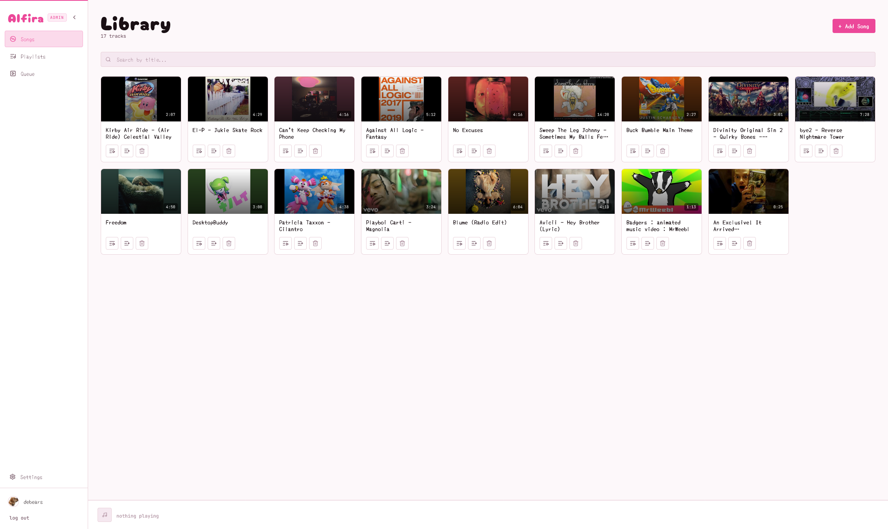
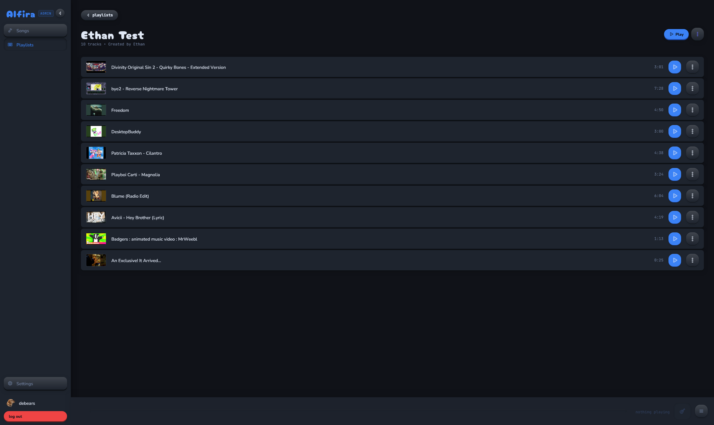
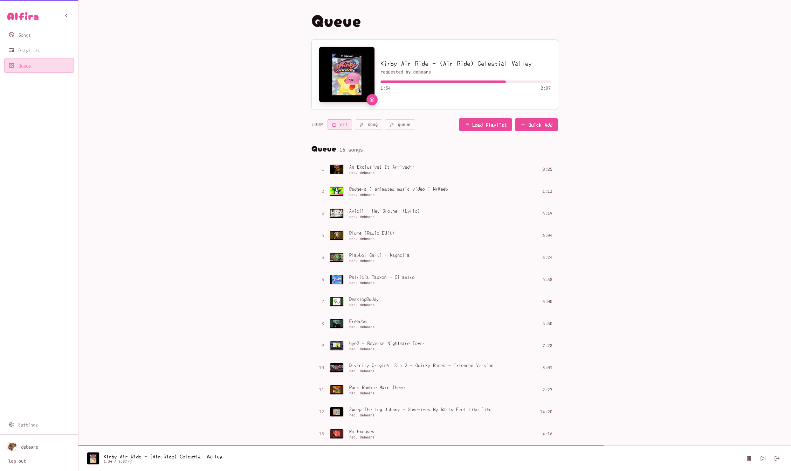

<h1 align="center">Alfira</h1>
<p align="center">
  
  <br>
  
  <br>
  
  
  
  <br>
  
  
  
  <br>
  
  <a href="https://github.com/ebears/alfira-bot/actions/workflows/docker-build.yml"></a>
</p>

**Alfira** is a self-hosted **Discord music bot** with a **web UI as the primary interface**. The bot handles joining voice channels and audio playback; the web app handles browsing songs, managing playlists, and controlling playback in real time.

> **Status:** This project is actively maintained but considered **experimental** and **pre-release**. Expect rough edges and potential breaking changes. Built primarily for personal use — YMMV.

## Features

- **Discord bot**
  - Slash commands: `/join`, `/leave`, `/play`, `/skip`, `/stop`, `/queue`, `/loop`, `/shuffle`, `/playlist play`, `/nowplaying`.
  - Queue management with loop modes (`off`, `song`, `queue`) and shuffle.
  - Audio playback via `yt-dlp` + `ffmpeg` + `@discordjs/voice`.
- **Web UI**
  - Discord OAuth2 login with role-based permissions (Admin vs Member).
  - Song library: add-by-URL via YouTube, delete, add to playlists (admins only).
  - Playlists: create/delete/rename, add/remove songs, play into the queue with sequential/random order and loop mode.
  - Player page + global Now Playing bar with live progress, queue view, and admin controls.
- **Real-time sync**
  - `Socket.io` events keep the UI in sync with the in-memory player state and library changes (no polling).
- **Single-guild focus**
  - Scoped to a single Discord server (guild), with admin status determined by Discord role IDs.

## Screenshots





## Tech Stack

Built with Node.js, TypeScript, Discord.js, React, PostgreSQL, and more. See the **[Tech Stack Documentation](docs/tech-stack.md)** for details.

<p align="center">
  
</p>

<h2 align="center">Quick Start (Production)</h2>

**Requirements:** Docker with Compose plugin.

### 1. Clone and Configure

```bash
git clone https://github.com/ebears/alfira-bot.git
cd alfira-bot
cp .env.example .env
```

### 2. Set Required Environment Variables

Edit `.env` with values from the [Discord Developer Portal](https://discord.com/developers/applications):

| Variable | Required | Description |
|----------|----------|-------------|
| `DISCORD_CLIENT_ID` | ✅ | Discord application client ID |
| `DISCORD_CLIENT_SECRET` | ✅ | Discord application client secret |
| `DISCORD_BOT_TOKEN` | ✅ | Discord bot token |
| `GUILD_ID` | ✅ | Your Discord server ID |
| `ADMIN_ROLE_IDS` | ✅ | Role ID(s) for admin permissions |
| `JWT_SECRET` | ✅ | Random secret string for JWT signing |
| `POSTGRES_PASSWORD` | ✅ | Database password |

### 3. Start the Stack

```bash
docker compose -f docker-compose.prod.yml up -d
```

This pulls the pre-built images and starts PostgreSQL, the API + bot, and the web UI.

### 4. Access the Web UI

- **Web UI:** `http://localhost:8080`
- **API:** `http://localhost:3001`

For production deployment with a reverse proxy and HTTPS, see the **[Full Installation Guide](docs/installation.md)**.

---

## Documentation

| Document | Description |
|----------|-------------|
| **[Installation Guide](docs/installation.md)** | Development and production setup, Discord configuration, reverse proxy setup |
| **[Configuration Reference](docs/configuration.md)** | Complete environment variables reference |
| **[Tech Stack](docs/tech-stack.md)** | Technology stack and project structure |
| **[Troubleshooting](docs/troubleshooting.md)** | Common issues and solutions |

---

## Acknowledgements

The use of `fs-capacitor` for audio streaming was inspired by [muse](https://github.com/museofficial/muse), a self-hosted Discord music bot.

---

## License

This project is licensed under the MIT License — see the [LICENSE](LICENSE) file for details.
