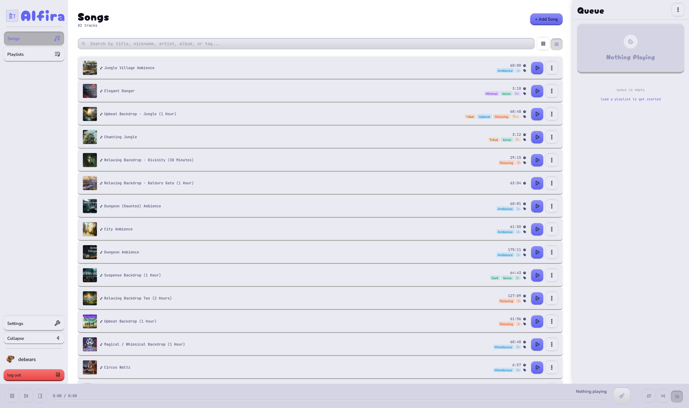
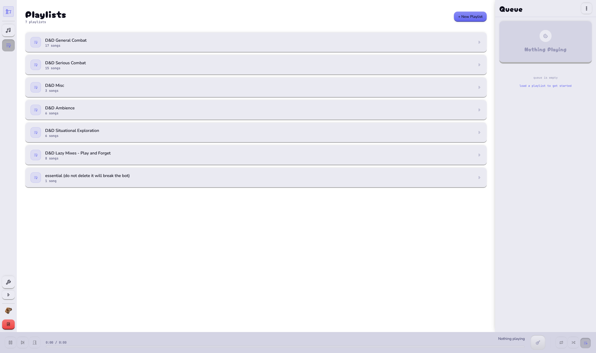
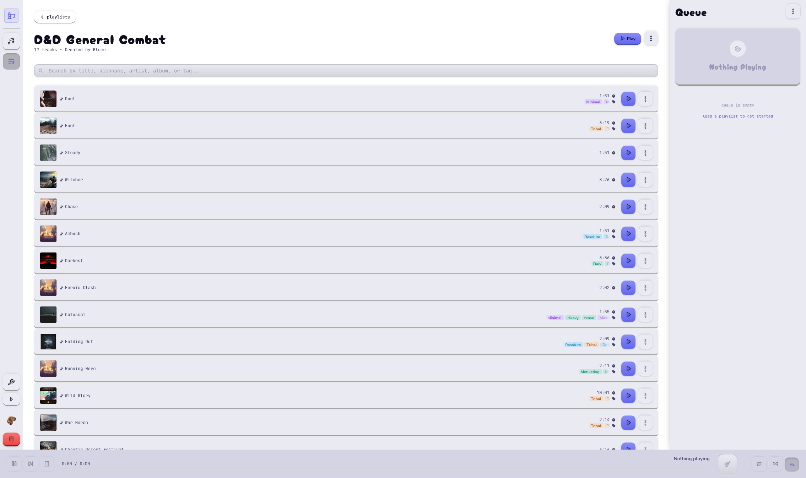
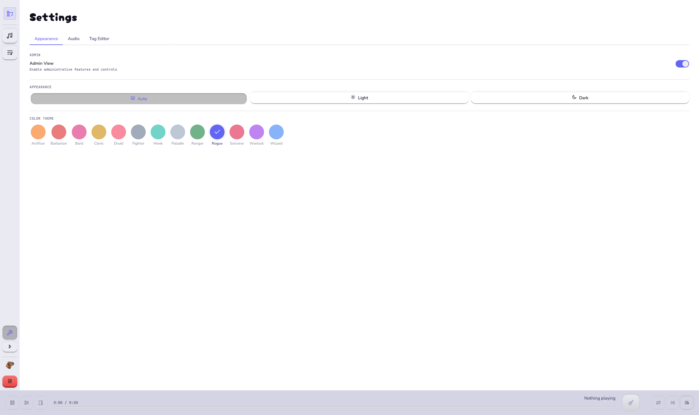
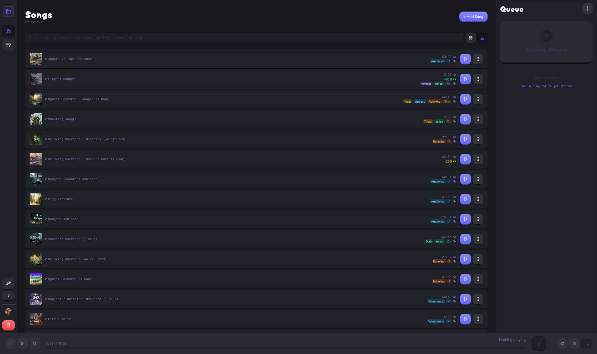
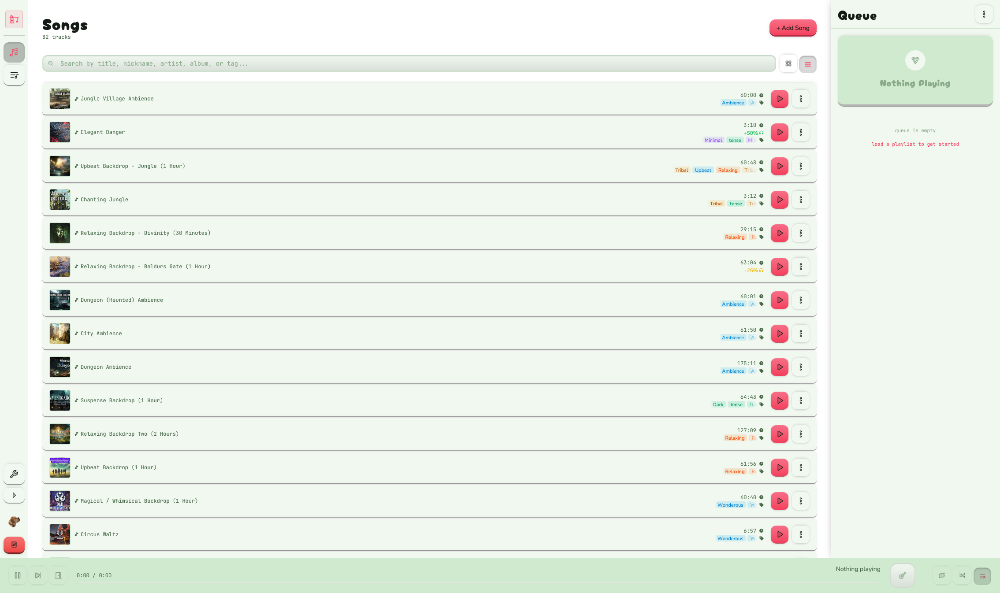
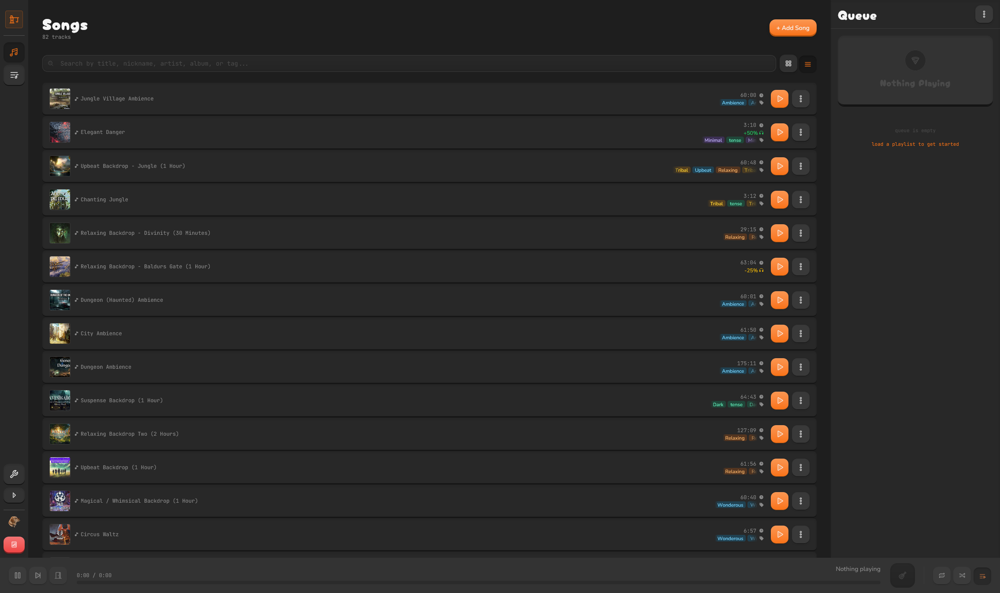
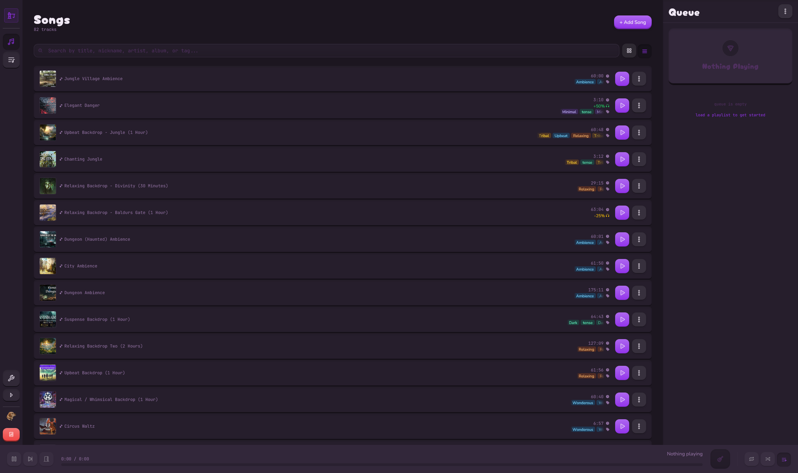
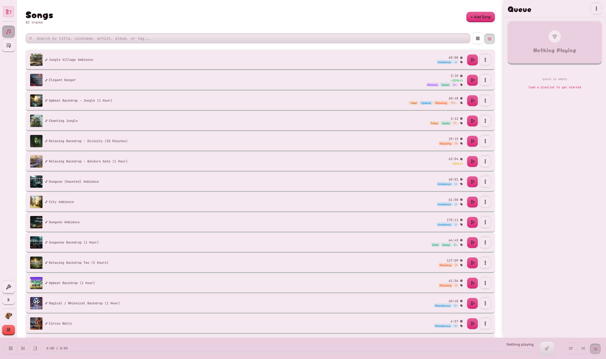
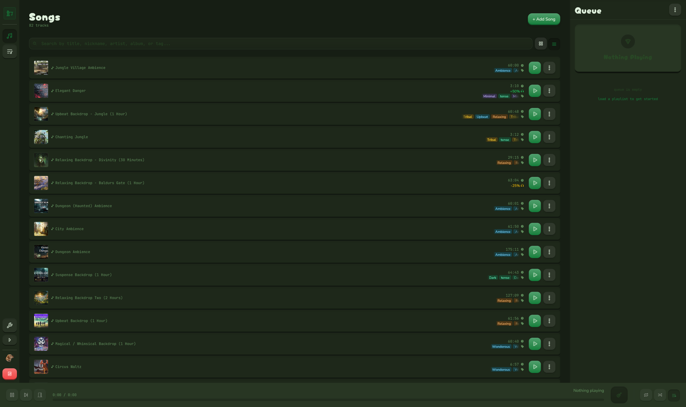

<h1 align="center">Alfira</h1>
<p align="center">
  
  <br>
  <a href="https://github.com/ebears/alfira"></a>
  <br>
  <a href="https://github.com/ebears/alfira/actions/workflows/docker-build.yml"></a>
  <br>
  <a href="https://bun.com/"></a>
  <a href="https://www.docker.com/"></a>
  <a href="https://www.sqlite.org/"></a>
  <br>
  <a href="https://react.dev/"></a>
  <a href="https://tailwindcss.com/"></a>
  <a href="https://github.com/drizzle-team/drizzle-orm"></a>
  <br>
  <a href="https://github.com/tiramisulabs/seyfert"></a>
  <a href="https://github.com/PerformanC/NodeLink"></a>
  <a href="https://github.com/Ganyu-Studios/Hoshimi"></a>
</p>

> **Status:** This project is actively maintained but considered **experimental** and **pre-release**.

## Features

**Alfira** is a self-hosted Discord music bot with a web UI for library management and real-time playback control. The intended scope of the bot is a single small to medium-sized Discord server.

### Web UI

- **Responsive layout** — Works on desktop and mobile
- **Different themes** — User-selectable auto/light/dark mode and color themes
- **Virtual scrolling** — Efficient rendering for large libraries
- **Now playing bar** — Persistent playback controls with progress bar and seek

### Music Library

- **Song management** — Add songs via YouTube links (playlist support included) to a persistent, shared library with duplicate detection
- **Edit metadata** — Set custom title, artist, album, and artwork per song
- **Tag system** — Organize songs with tags; color-code and canonicalize tag names
- **Playlists** — Create & manage private or public playlists from the library
- **Search & filter** — Search by title, artist, album, or tags

### Playback

- **Discord voice** — Play, pause, seek, and skip songs from the library or any playlist in a Discord call
- **Loop modes** — Off, song, or queue
- **Shuffle / unshuffle** — Randomize queue order, with the ability to restore the original order
- **Per-song volume offset** — Adjust playback volume for individual songs
- **Audio filters** — Fine-tune audio with a graphical equalizer and compressor

### Queue Management

- **Priority queue** — Add songs to "Up Next" to play immediately after the current track
- **Quick add** — Paste a YouTube URL directly into the queue without saving to the library
- **Override** — Instantly replace the queue with a YouTube URL and start playing

### Authentication & Authorization

- **Discord OAuth2** — Log in with your Discord account; guild membership required
- **Admin roles** — Use Discord role IDs to control access to admin access

### Real-Time Updates

- **WebSocket sync** — Queue state, now playing, and elapsed time update across all clients in real time
- **Live song events** — Songs added, updated, or deleted propagate instantly to all connected users
- **Playlist events** — Playlist changes broadcast to all clients

## Screenshots

<p align="center">
  
</p>

<details>
  <summary>Click to see more screenshots</summary>
  <p align="center">
    
    
    <br>
    
    
    <br>
    
    
    
    
    
    
  </p>
</details>

---

<p align="center">
  
</p>

<h2 align="center">Quick Start with Docker</h2>

```bash
# 1. Copy docker-compose.prod.yml and .env.example from this repo to the folder you want the bot to live.
curl -o docker-compose.prod.yml https://raw.githubusercontent.com/ebears/alfira/main/docker-compose.prod.yml
curl -o .env.example https://raw.githubusercontent.com/ebears/alfira/main/.env.example

# 2. Rename docker-compose.prod.yml to docker-compose.yml and .env.example to .env.
cp docker-compose.prod.yml docker-compose.yml
cp .env.example .env

# 3. Configure the .env.
nano .env  # or micro, zed, code, vim, etc.

# 4. Start the stack - web UI at http://localhost:8180
docker compose up -d
```

For public deployment with a reverse proxy and HTTPS, see the **[Full Installation Guide](docs/installation.md)**.

---

## Documentation

| Document | Description |
|----------|-------------|
| **[Installation Guide](docs/installation.md)** | Development and production setup, Discord configuration, reverse proxy setup |
| **[Configuration Reference](docs/configuration.md)** | Complete environment variables reference |
| **[Tech Stack](docs/tech-stack.md)** | Technology stack and project structure |
| **[Biome Setup](docs/biome-setup.md)** | Editor setup for Biome linting and formatting |
| **[Troubleshooting](docs/troubleshooting.md)** | Common issues and solutions |

---

## License

This project is licensed under the MIT License — see the [LICENSE](LICENSE) file for details.
