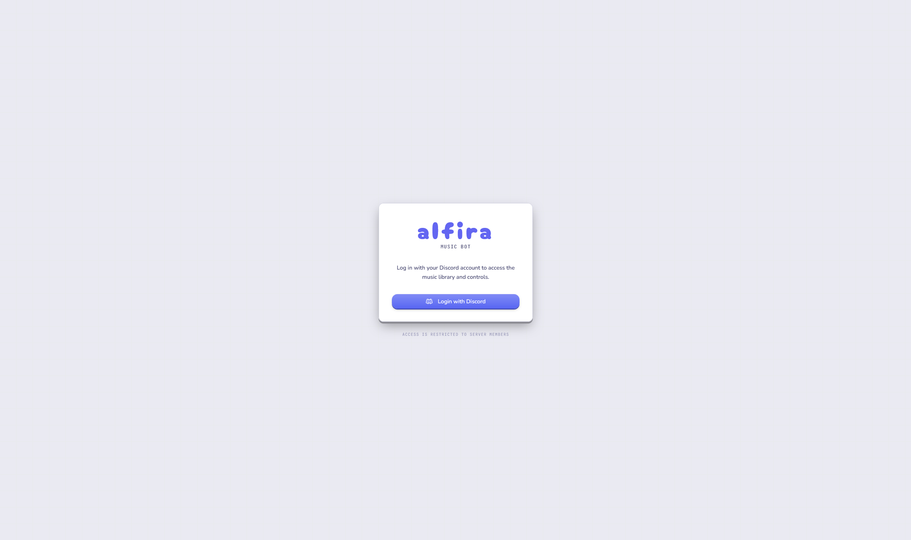
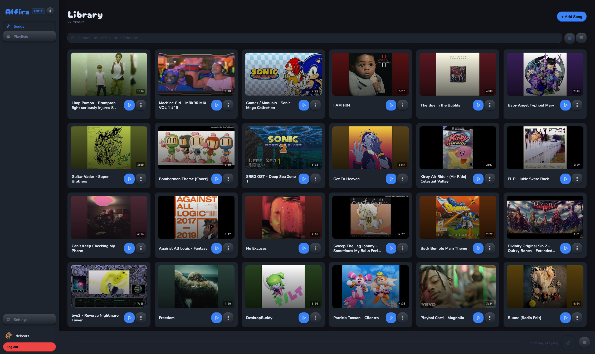
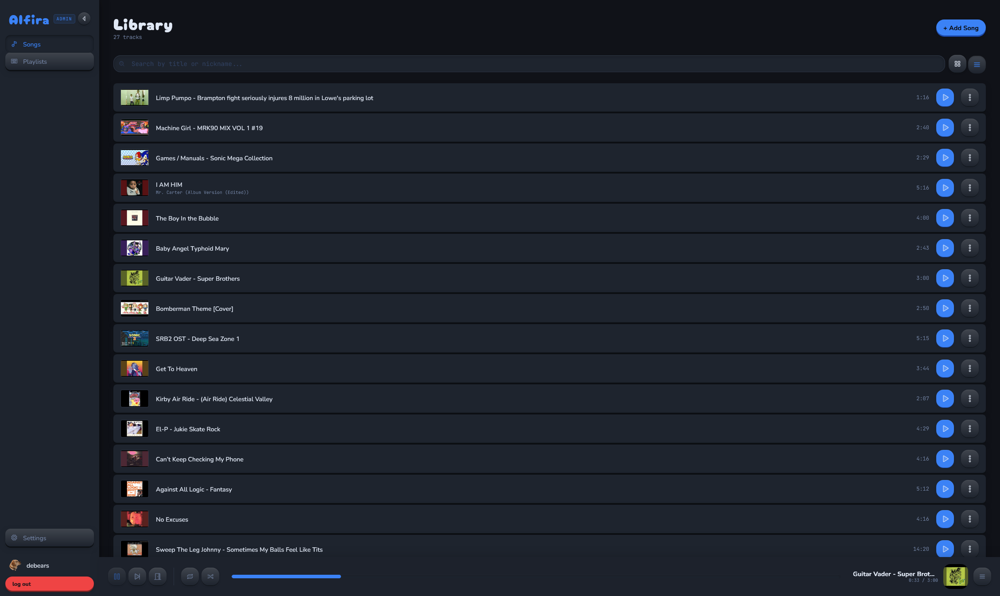
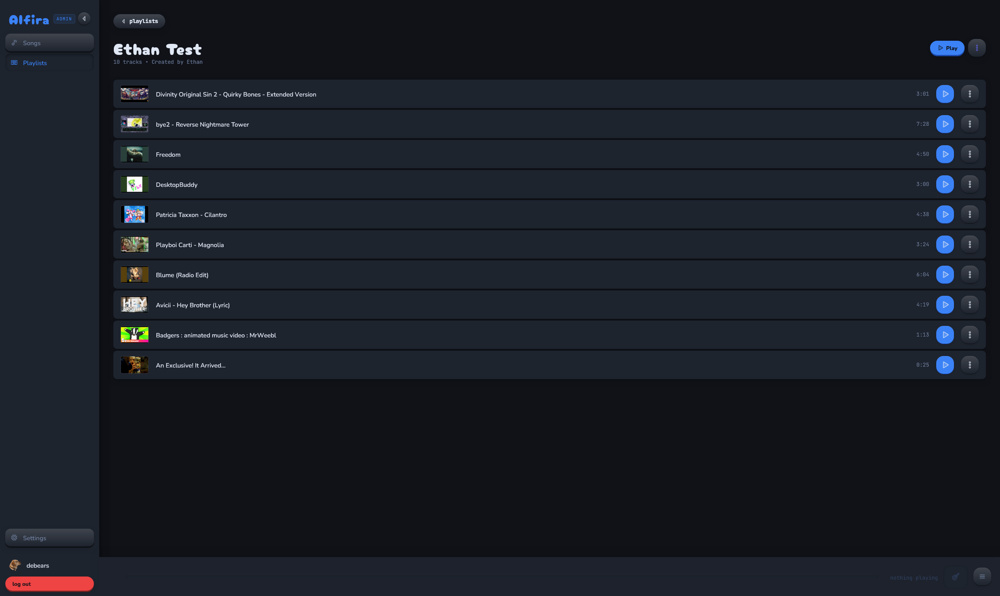
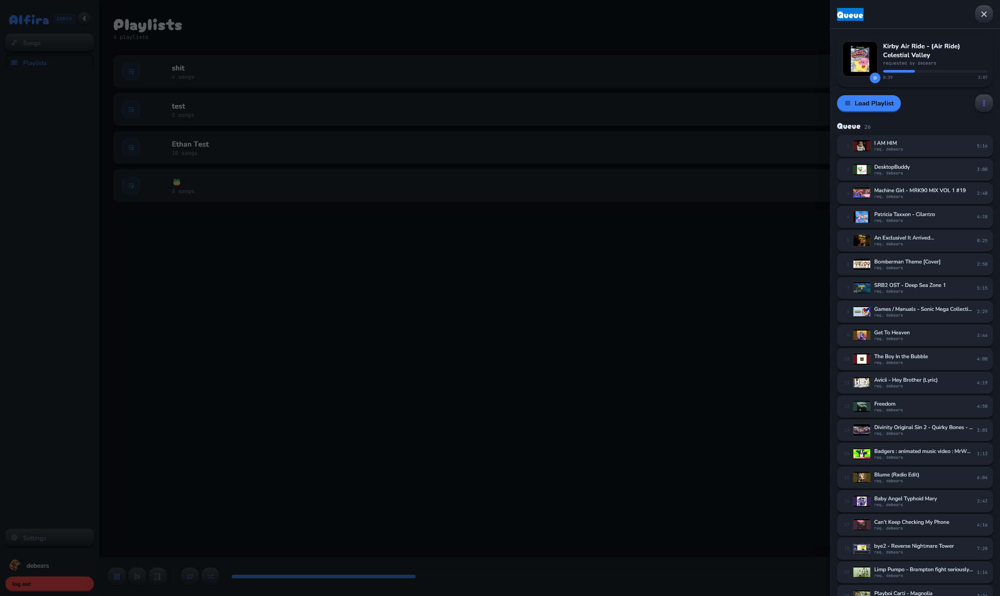

<h1 align="center">Alfira</h1>
<p align="center">
  
  <br>
  
  <br>
  
  
  
  <br>
  
  
  
  <br>
  <a href="https://github.com/ebears/alfira/actions/workflows/docker-build.yml"></a>
</p>

> **Status:** This project is actively maintained but considered **experimental** and **pre-release**. Expect rough edges and potential breaking changes. Built primarily for personal use — YMMV.

## Features

**Alfira** is a self-hosted Discord music bot with a web UI for library management and real-time playback control. It's intended to be scoped to one Discord server.

- **Song library** — add via YouTube URL, search, edit metadata (nickname, artist, album, tags, volume offset).
- **Playback control** — play/pause, skip, stop, loop mode, shuffle, instant queue via "Up Next".
- **Playlist management** — create, rename, toggle visibility (public/private), add/remove songs.
- **Admin controls** — quick-add YouTube URL, load playlist into queue, override with direct URL, clear queue.
- **Now Playing bar** — live progress bar, album art, playback controls, loop/shuffle toggles.
- **Queue panel** — prioritized queue view with drag-free reordering via Up Next.
- **Real-time sync** — WebSocket-driven — UI stays in sync without polling.
- **In-memory player** — bot and API share memory for zero-latency real-time updates.

## Screenshots







## Tech Stack

Built with Bun, TypeScript, Discord.js, React, PostgreSQL, and more. See the **[Tech Stack Documentation](docs/tech-stack.md)** for details.

<p align="center">
  
</p>

<h2 align="center">Quick Start (Docker)</h2>

### 1. Set Required Environment Variables

Copy the `docker-compose.prod.yml` and `.env.example` from this repo. Rename `.env.example` to `.env` and to your liking. Some values require the [Discord Developer Portal](https://discord.com/developers/applications).

| Variable | Required | Description |
|----------|----------|-------------|
| `DISCORD_CLIENT_ID` | ✅ | Discord application client ID |
| `DISCORD_CLIENT_SECRET` | ✅ | Discord application client secret |
| `DISCORD_BOT_TOKEN` | ✅ | Discord bot token |
| `GUILD_ID` | ✅ | Your Discord server ID |
| `ADMIN_ROLE_IDS` | ✅ | Role ID(s) for admin permissions |
| `JWT_SECRET` | ✅ | Random secret string for JWT signing |
| `POSTGRES_USER` | ✅ | Database username |
| `POSTGRES_PASSWORD` | ✅ | Database password |
| `POSTGRES_DB` | ✅ | Database name |

### 2. Start the Stack

```bash
docker compose -f docker-compose.prod.yml up -d
```

This starts Alfira and PostgreSQL.

### 3. Access the Web UI

- **Web UI:** `http://localhost:8080`
- **API:** `http://localhost:3001`

For production deployment with a reverse proxy and HTTPS, see the **[Full Installation Guide](docs/installation.md)**.

---

## Documentation

| Document | Description |
|----------|-------------|
| **[Installation Guide](docs/installation.md)** | Development and production setup, Discord configuration, reverse proxy setup |
| **[Configuration Reference](docs/configuration.md)** | Complete environment variables reference |
| **[Tech Stack](docs/tech-stack.md)** | Technology stack and project structure |
| **[Troubleshooting](docs/troubleshooting.md)** | Common issues and solutions |

---

## Acknowledgements

The use of `fs-capacitor` for audio streaming was inspired by [Muse](https://github.com/museofficial/muse).

---

## License

This project is licensed under the MIT License — see the [LICENSE](LICENSE) file for details.
