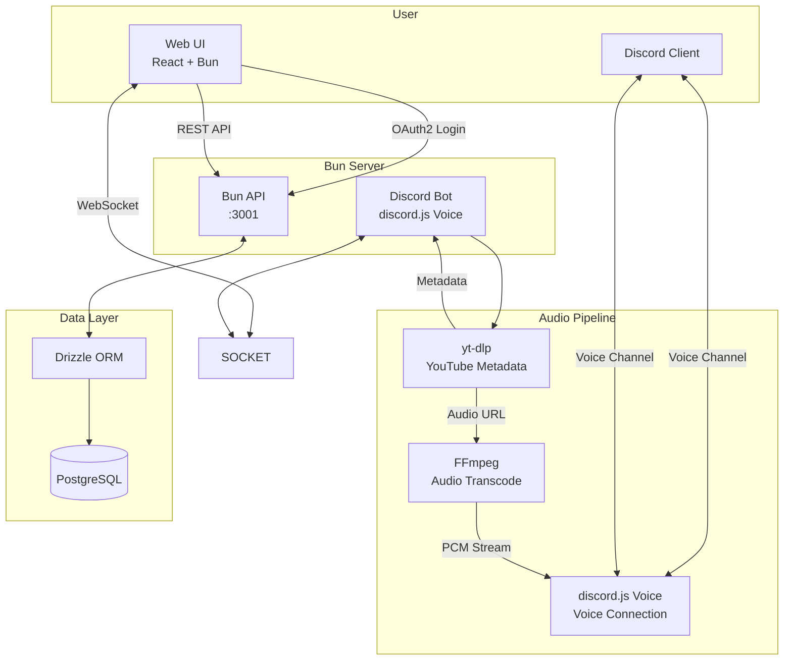

# Tech Stack

## Overview

| Component | Technology |
|-----------|------------|
| **Runtime** | Bun |
| **Language** | TypeScript |
| **Discord** | `discord.js` v14, `@discordjs/voice`, `@snazzah/davey` |
| **Audio** | `yt-dlp`, `ffmpeg` |
| **API** | Bun native HTTP + WebSocket |
| **Database** | PostgreSQL + Drizzle ORM |
| **Frontend** | React + Bun + Tailwind |
| **Logging** | Pino |

## Architecture



The bot and API run in a **single Bun process**, sharing the same memory for the player state. This allows real-time updates to be broadcast directly from the bot's playback events without any additional infrastructure.

## Project Structure

The project is a Bun workspaces monorepo:

```
packages/
├── shared    # Shared types and runtime utilities (formatDuration, fisherYatesShuffle)
├── bot       # Discord bot (GuildPlayer, yt-dlp wrapper)
├── api       # Bun API, Drizzle ORM
└── web       # React + Tailwind web UI
```

## Development Scripts

Top-level scripts:

| Script | Description |
|--------|-------------|
| `bun run dev` | Build shared + bot locally, then start all services with Docker |
| `bun run web:build` | Build the web UI (used by Docker) |
| `bun run db:generate` | Generate Drizzle migration files |
| `bun run db:migrate` | Run Drizzle migrations |
| `bun run check` | Lint and format with auto-fix (Biome) |
| `bun run lint:fix` | Lint with auto-fix |
| `bun run format` | Format with auto-fix |

## Shared Package Exports

`@alfira-bot/shared` provides types and utilities consumed by all other packages:

### Types

| Type | Description |
|------|-------------|
| `Song` | Database song model (id, title, youtubeUrl, duration, thumbnailUrl, etc.) |
| `QueuedSong` | Song with `requestedBy` display name (runtime queue property) |
| `LoopMode` | `'off'` \| `'song'` \| `'queue'` |
| `QueueState` | Full player state snapshot for real-time broadcasts |
| `Playlist` | Database playlist model with optional song count |
| `PlaylistSong` | Join table entry linking a song to a playlist at a position |
| `PlaylistDetail` | Playlist with fully populated songs array |
| `PlaylistSongWithSong` | PlaylistSong where the song is guaranteed present |
| `User` | Authenticated Discord user (discordId, username, avatar, isAdmin) |

### Utilities

| Function | Description |
|----------|-------------|
| `formatDuration(seconds)` | Formats seconds as `mm:ss` or `h:mm:ss` |
| `fisherYatesShuffle(array)` | In-place Fisher-Yates shuffle |

## CI Workflows

Three GitHub Actions workflows run on the repository:

| Workflow | Trigger | Purpose |
|----------|---------|---------|
| **typecheck.yml** | PRs and pushes to `main` | Lint with Biome + typecheck all packages |
| **docker-build.yml** | PRs and pushes to `main` (ignores `docs/`) | Build Docker images; publish to GHCR on `main` |
| **ytdlp-update-check.yml** | Weekly (Monday 00:00 UTC) | Check for yt-dlp updates, auto-create issues |
