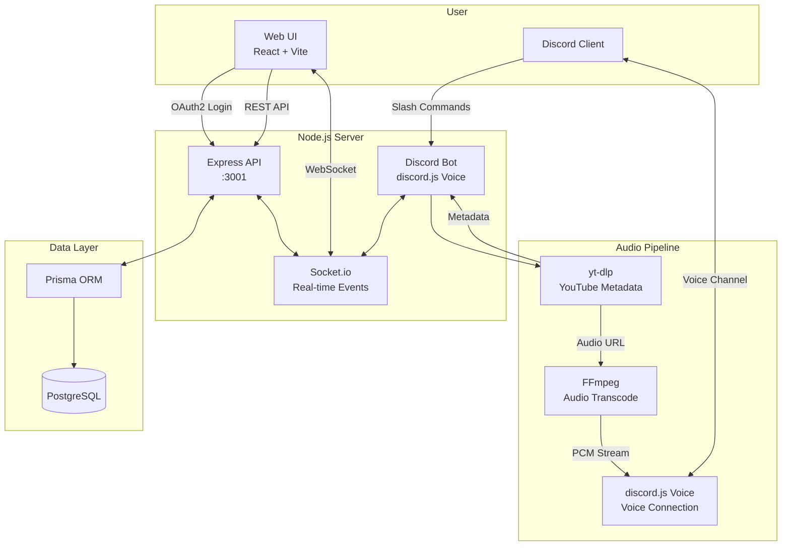

# Tech Stack

## Overview

| Component | Technology |
|-----------|------------|
| **Runtime** | Node.js 25 |
| **Language** | TypeScript |
| **Discord** | `discord.js` v14, `@discordjs/voice`, `@snazzah/davey` |
| **Audio** | `yt-dlp`, `ffmpeg` |
| **API** | Express.js |
| **Real-time** | Socket.io |
| **Database** | PostgreSQL + Prisma |
| **Frontend** | React (Vite) + Tailwind CSS |

## Architecture



The bot and API run in a **single Node.js process**, sharing the same memory for the player state. This allows Socket.io to broadcast real-time updates directly from the bot's playback events without any additional infrastructure.

## Project Structure

The project is a pnpm workspaces monorepo:

```
packages/
├── shared    # Shared types and runtime utilities (formatDuration, fisherYatesShuffle)
├── bot       # Discord bot (slash commands, GuildPlayer, yt-dlp wrapper)
├── api       # Express API, Prisma, Socket.io server
└── web       # Vite + React + Tailwind web UI
```

## Development Scripts

Top-level scripts:

| Script | Description |
|--------|-------------|
| `npm run dev` | Start the API + bot |
| `npm run web:dev` | Start the Vite dev server for the web UI |
| `npm run db:generate` | Generate Prisma client |
| `npm run db:migrate` | Run Prisma migrations |
